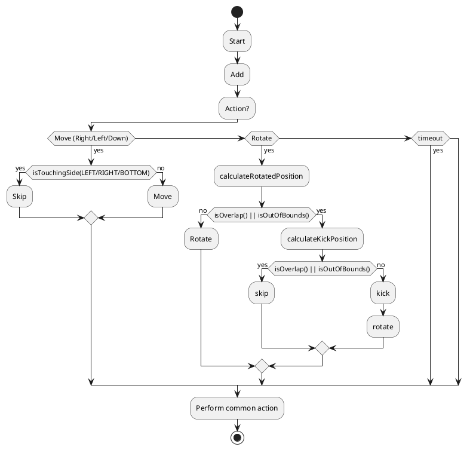

```plantuml
@startuml
start

:Start;
:Add;
:Action?;
if (Move (Right/Left/Down)) then (yes)
    if (isTouchingSide(LEFT/RIGHT/BOTTOM)) then (yes)
        :Skip;
    else (no)
        :Move;
    endif
else if (Rotate) then (yes)
     :calculateRotatedPosition;
     
     if (isOverlap() || isOutOfBounds()) then (no)
        :Rotate;
     else (yes)
             :calculateKickPosition;
            if (isOverlap() || isOutOfBounds()) then (yes)
                :skip;
            else (no)
                :kick;
                :rotate;
            endif
     
     endif
     
     
else if (timeout) then (yes)
endif
:Perform common action;
stop
@enduml


```